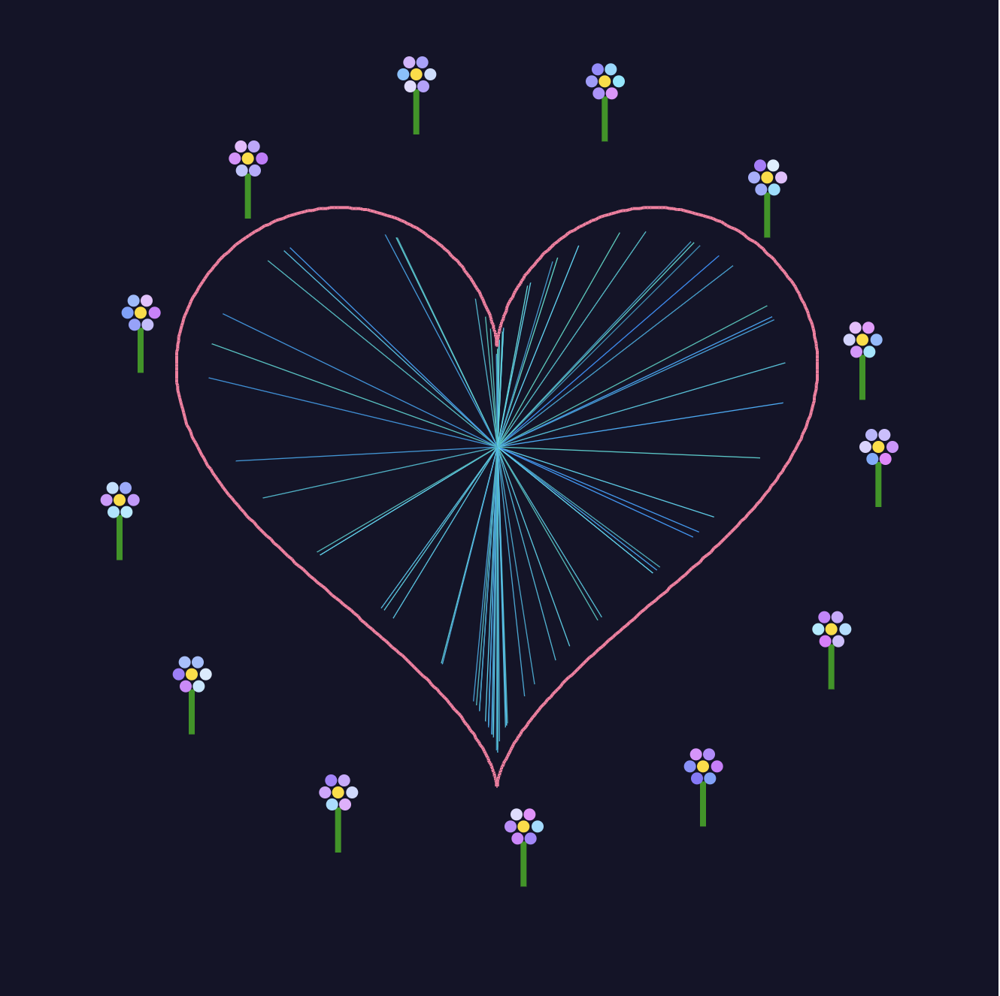

# Heart SVG Generator ❤️

## Description

A C program that generates a colorful heart-shaped SVG image using mathematical equations, random colors, and SVG elements.

The program uses parametric equations to calculate the heart shape and creates an HTML file containing the generated SVG artwork.

## Features

- Generates a heart shape using parametric equations
- Creates SVG graphics using C
- Draws colorful lines from the heart outline to the center
- Generates decorative flowers around the heart
- Uses random colors for unique outputs
- Automatically creates an HTML file containing the artwork

## Concepts Practiced

- Functions
- File handling
- Pointers
- Mathematical calculations
- Parametric equations
- Random number generation
- Using C libraries:
  - `math.h`
  - `time.h`
- SVG and HTML generation

## Technologies Used

- C Programming
- SVG (Scalable Vector Graphics)
- HTML

## How It Works

1. Opens an HTML file for writing
2. Creates an SVG canvas
3. Uses a parametric equation to generate heart coordinates
4. Draws the heart outline using SVG lines
5. Adds random colorful lines inside the heart
6. Generates flowers around the heart using circles and rectangles
7. Saves the final artwork as an HTML file

## How to Run

Compile the program:

clang heart.c -o heart -lm

Run the program:

./heart

The generated file will be:

svg.html

Open `svg.html` in a web browser to view the artwork.

## Output Preview

The program generates a heart design with flowers, colorful patterns, and random variations.

