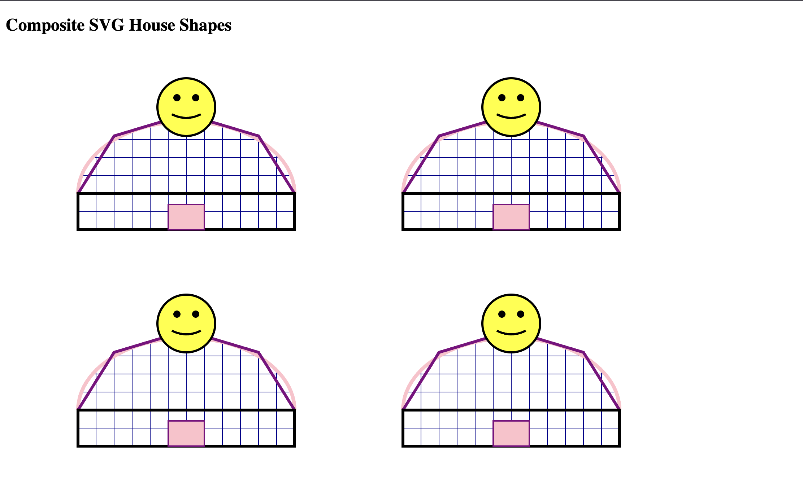

# SVG House Generator 🏠

## Description

A C program that generates an HTML file containing multiple SVG house illustrations. The program uses reusable drawing functions, loops, and parameters to create composite SVG shapes with decorative smiley faces.

The project demonstrates procedural graphics by combining SVG elements such as paths, polylines, rectangles, and circles into complete illustrations.

## Features

- Generates multiple SVG houses automatically
- Creates composite shapes using SVG elements
- Uses reusable functions for drawing components
- Positions houses using x and y offsets
- Adds decorative smiley faces above each house
- Creates a grid pattern using SVG definitions
- Automatically generates an HTML file containing the artwork

## Concepts Practiced

- Functions
- Parameters
- Loops
- Nested loops
- SVG graphics
- HTML generation
- Procedural graphics
- Code reuse

## Technologies Used

- C Programming
- HTML
- SVG (Scalable Vector Graphics)

## How It Works

1. Opens an HTML output file
2. Creates an SVG canvas
3. Defines a reusable grid pattern
4. Draws multiple houses using reusable functions
5. Adds smiley faces using SVG circles and paths
6. Saves the generated artwork as an HTML file

## How to Run

Compile the program:

```bash
clang svg_house_generator.c -o svg_house_generator
```

Run the program:

```bash
./svg_house_generator
```

The program will generate:

```
house.html
```

Open `house.html` in a web browser to view the SVG artwork.

## Output Preview


